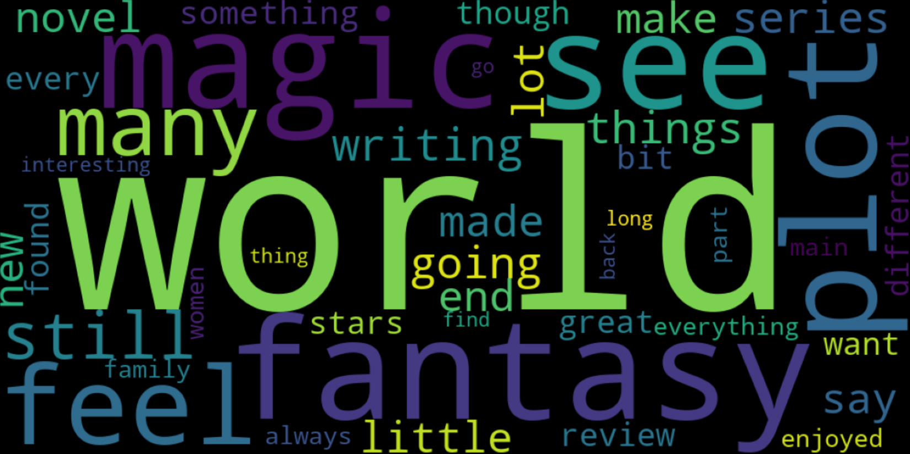

  

# 📚 Sentiment Analysis of Goodreads Choice Awards Book Data (2021–2023)

**Course:** DSCB230 – Sommersemester 2024  
**Group Name:** Oscar

## 👥 Team Members
- Seniz Kurhan  
- ***  
- ***  

## 🔍 Project Overview

This project analyzes Goodreads Choice Awards data from 2021 to 2023, focusing on genre popularity and sentiment analysis of book reviews.

### Objectives:
- **Genre Popularity and Sentiment Correlation:** Identify the most voted genres and analyze correlations with review sentiments.
- **Linguistic Patterns in Top Genres:** Build bag-of-words models for the top five genres and compare keyword frequencies.
- **Trend Analysis in Sentiment:** Examine trends in sentiment (positive/negative) across genres over three years.
- **Author and Genre Analysis:** Investigate top authors by genre and analyze sentiments in their dominant genres.
- **Rating vs. Sentiment Comparison:** Compare average Goodreads ratings with sentiment scores to find discrepancies.

## 📂 Table of Contents
1. **Data Collection**
   - Collection of Book Page URLs
   - Scraping Book Info & Reviews
2. **Data Preprocessing**
   - Cleaning Text Data
   - Tokenization, Lemmatization, Stopword Removal
3. **Data Analysis**
   - Genre Popularity & Sentiment Correlation
   - Author & Genre Insights
   - Linguistic Pattern Analysis
   - Sentiment Trends Over Time
   - Ratings vs. Sentiment Comparison
4. **Lessons Learned**

---

